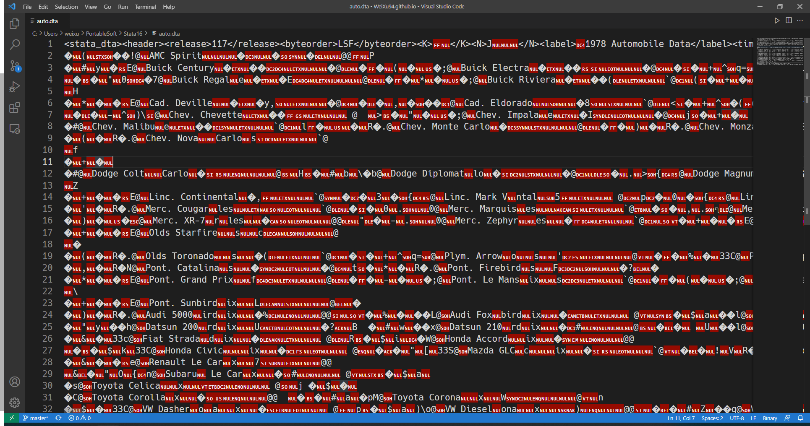

dta 文件里面到底什么样子？首先 vscode 里面打开看一下：



之后整理了一下里面可见的文字，大概是下面这种格式：

```xml
<stata_dta>
    <header>
        <release>117</release>
        <byteorder>LSF</byteorder>
        <K></K>
        <N>J</N>
        <label>1978 Automobile Data</label>
        <timestamp>13 Apr 2018 17:45</timestamp>
    </header>
    <map></map>
    <variable_types></variable_types>
    <varnames>make price foreign...</varnames>
    <sortlist></sortlist>
    <formats>%8.0gc ...</formats>
    <value_label_names></value_label_names>
    <variable_labels><variable_labels>
    <characteristics><ch>Consumer Reports with permission</ch><ch></ch></characteristics>
    <data>AMC Concord this should be the data part. Here is lots of contents.</data>
        <strls></strls>
        <value_labels><lbl>Domestic Foreign</lbl></value_labels>
</stata_dta>
```

看起来是一直类似 XML 的树状结构，\<header\> 里面主要是一些 metadata，还有变量名，变量标签，以及变量格式等内容，主要数据则存储在 \<data\> tag 里。
